# **EcoCria — Estrutura Organizacional**

Este documento apresenta a estrutura organizacional oficial da EcoCria, organizada em quatro níveis: **Estratégico**, **Tático**, **Gerencial** e **Operacional**.
A organização foi desenhada para refletir o caráter artesanal, criativo e sustentável da empresa, mantendo simplicidade, clareza e eficiência.

---

## **Visão Geral**

A estrutura da EcoCria foi construída para garantir:

* Clareza na responsabilidade de cada área
* Fluidez entre criação, produção e venda
* Alinhamento entre visão artística e gestão profissional
* Sustentabilidade financeira e cultural

A organização é enxuta, mas cobre todas as áreas essenciais da empresa.

---

## **Pirâmide Organizacional**

```mermaid
graph TB
    %% -------------------------
    %% NÍVEL ESTRATÉGICO
    %% -------------------------
    CEO[🌿 CEO<br/>Direção & Estratégia]

    %% Filhos estratégicos (Áreas Táticas)
    CEO --> PROD_TAT[🪵 Coord. de Operações & Produção]
    CEO --> DESIGN_TAT[🎨 Coord. de Produto & Design]
    CEO --> COM_TAT[🛒 Coord. Comercial & Distribuição]
    CEO --> FIN_TAT[💰 Coord. Financeiro & Compras]
    CEO --> PESS_TAT[❤️ Coord. Pessoas & Cultura]

    %% -------------------------
    %% NÍVEL TÁTICO  → GERENCIAL
    %% -------------------------
    PROD_TAT --> PROD_GER[🛠️ Supervisor de Produção]
    PROD_TAT --> QUALI_GER[🔍 Supervisor de Qualidade & Acabamento]

    DESIGN_TAT --> DESIGN_GER[✨ Supervisor de Design & Protótipos]

    COM_TAT --> COM_GER[📦 Supervisor Comercial & Logística]

    FIN_TAT --> FIN_GER[📋 Supervisor Financeiro]

    PESS_TAT --> PESS_GER[🌱 Supervisor de Rotina & Cultura]

    %% -------------------------
    %% NÍVEL GERENCIAL → OPERACIONAL
    %% -------------------------
    PROD_GER --> ARTESAOS[🔨 Artesãos / Produção]
    PROD_GER --> MATERIAIS[🪚 Corte & Preparação de Materiais]

    QUALI_GER --> ACABA[🧴 Acabamento & Embalagem]

    DESIGN_GER --> FOTOS[📷 Fotografia & Catálogo Digital]

    COM_GER --> ATEND[💬 Atendimento & Mensagens]
    COM_GER --> ENVIO[📮 Preparação de Pedidos & Envios]
    COM_GER --> FEIRA[🛍️ Banca de Feiras]

    FIN_GER --> REG_FIN[📝 Registro Financeiro]
    FIN_GER --> CUSTOS[💲 Apuração de Custos & Estoque]

    PESS_GER --> ROTINA[📅 Organização de Rotina]
    PESS_GER --> SEG_ATELIER[🧯 Segurança no Ateliê]

    %% ============================================================
    %% ======================== ESTILO =============================
    %% ============================================================

    %% Estratégico - Azul Claro
    style CEO fill:#e3f2fd,stroke:#1976d2,stroke-width:3px,color:#000

    %% Tático - Verde Claro
    style PROD_TAT fill:#e8f5e9,stroke:#43a047,stroke-width:2px,color:#000
    style DESIGN_TAT fill:#e8f5e9,stroke:#43a047,stroke-width:2px,color:#000
    style COM_TAT fill:#e8f5e9,stroke:#43a047,stroke-width:2px,color:#000
    style FIN_TAT fill:#e8f5e9,stroke:#43a047,stroke-width:2px,color:#000
    style PESS_TAT fill:#e8f5e9,stroke:#43a047,stroke-width:2px,color:#000

    %% Gerencial - Amarelo Claro
    style PROD_GER fill:#fff9c4,stroke:#f9a825,stroke-width:2px,color:#000
    style QUALI_GER fill:#fff9c4,stroke:#f9a825,stroke-width:2px,color:#000
    style DESIGN_GER fill:#fff9c4,stroke:#f9a825,stroke-width:2px,color:#000
    style COM_GER fill:#fff9c4,stroke:#f9a825,stroke-width:2px,color:#000
    style FIN_GER fill:#fff9c4,stroke:#f9a825,stroke-width:2px,color:#000
    style PESS_GER fill:#fff9c4,stroke:#f9a825,stroke-width:2px,color:#000

    %% Operacional - Laranja Claro
    style ARTESAOS fill:#ffe0b2,stroke:#fb8c00,stroke-width:1px,color:#000
    style MATERIAIS fill:#ffe0b2,stroke:#fb8c00,stroke-width:1px,color:#000
    style ACABA fill:#ffe0b2,stroke:#fb8c00,stroke-width:1px,color:#000
    style FOTOS fill:#ffe0b2,stroke:#fb8c00,stroke-width:1px,color:#000
    style ATEND fill:#ffe0b2,stroke:#fb8c00,stroke-width:1px,color:#000
    style ENVIO fill:#ffe0b2,stroke:#fb8c00,stroke-width:1px,color:#000
    style FEIRA fill:#ffe0b2,stroke:#fb8c00,stroke-width:1px,color:#000
    style REG_FIN fill:#ffe0b2,stroke:#fb8c00,stroke-width:1px,color:#000
    style CUSTOS fill:#ffe0b2,stroke:#fb8c00,stroke-width:1px,color:#000
    style ROTINA fill:#ffe0b2,stroke:#fb8c00,stroke-width:1px,color:#000
    style SEG_ATELIER fill:#ffe0b2,stroke:#fb8c00,stroke-width:1px,color:#000
```

---

## **Descrição dos Níveis**

### **3.1 — Estratégico (CEO / Direção)**

Responsável por visão, metas, decisões e sustentabilidade de longo prazo.
Define os rumos da EcoCria, o portfólio de produtos, parcerias e posicionamento.

---

### **3.2 — Tático (Coordenação das Áreas)**

Transforma a estratégia em planejamento concreto.
Cuida de ciclos de produção, calendário criativo, ações comerciais e controle financeiro.

Áreas táticas incluem:

* Operações & Produção
* Produto & Design
* Comercial & Distribuição
* Financeiro & Compras
* Pessoas & Cultura

---

### **3.3 — Gerencial (Supervisão)**

Garante que o dia a dia flua sem bloqueios.
Acompanha prazos, qualidade, comunicação com clientes e organização do atelier.

---

### **3.4 — Operacional (Execução)**

Execução direta do trabalho artesanal, atendimento e logística.
É onde a EcoCria acontece de forma concreta.

---

## **Cargos e Responsabilidades Detalhadas**

### **Nível Estratégico**

#### **• CEO / Diretor Geral**

* Define visão, metas, prioridades e calendário anual
* Aprova portfólio, protótipos principais e identidade geral
* Garante sustentabilidade financeira
* Cria parcerias e oportunidades de crescimento
* Remove bloqueios entre áreas

---

### **Nível Tático**

#### **• Coordenador de Operações & Produção**

* Planeja ciclos produtivos
* Define padrões mínimos de qualidade e materiais
* Organiza fluxo do atelier

#### **• Coordenador de Produto & Design**

* Cria protótipos e novas linhas
* Mantém coerência estética da marca
* Desenvolve embalagens e storytelling

#### **• Coordenador Comercial & Distribuição**

* Planeja vendas, feiras e campanhas
* Define políticas comerciais e kits
* Garante oferta ideal nos canais digitais

#### **• Coordenador Financeiro & Compras**

* Planeja fluxo de caixa
* Garante reposição de materiais
* Mantém custos alinhados com margens desejadas

#### **• Coordenador de Pessoas & Cultura**

* Mantém rotina saudável e alinhamento da equipe
* Cria rituais simples de cultura
* Organiza treinamentos curtos e comunicação interna

---

### **Nível Gerencial**

#### **• Supervisor de Produção**

* Acompanha execução diária
* Organiza materiais e ferramentas
* Garante cumprimento de prazos

#### **• Supervisor de Qualidade & Acabamento**

* Verifica acabamento final
* Mantém padrões artesanais da marca
* Prepara produtos para embalagem e envio

#### **• Supervisor Comercial**

* Acompanha pedidos
* Responde clientes
* Organiza logística de envios e estoque online

#### **• Supervisor Financeiro**

* Registra movimentações
* Mantém custos e inventário atualizados
* Prepara dados para análise estratégica

---

### **Nível Operacional**

#### **• Artesão / Produção Manual**

* Executa montagem, corte, lixamento, acabamento
* Mantém ritmo, organização e qualidade

#### **• Acabamento & Embalagem**

* Realiza polimento, inspeção e embalagem final

#### **• Logística Interna**

* Separa materiais
* Organiza suprimentos
* Prepara cargas para feiras e envios

#### **• Comercial Operacional**

* Publica anúncios, responde clientes
* Embala pedidos e envia
* Auxilia na banca em feiras

#### **• Suporte Digital**

* Fotografa produtos
* Atualiza catálogo
* Mantém descrições e preços online

---

## **Uso da Estrutura na Gestão**

* Cada tarefa no Kanban deve receber uma **etiqueta da área correspondente**.
* Cada nível da pirâmide define **quem decide, quem planeja, quem supervisiona e quem executa**.
* A estrutura é flexível: uma mesma pessoa pode ocupar múltiplos papéis, desde que haja clareza.
* Serve como base para:

  * divisão de responsabilidades,
  * rituais semanais,
  * KPIs simples por área,
  * onboarding de novos colaboradores.
