# 🌿 EcoCria — Estrutura Organizacional

Esta página apresenta a estrutura oficial da EcoCria, construída para ser leve, clara e prática.

!!! abstract "Para que serve esta estrutura?"
    - Garantir **criatividade ativa** sem perder o controle operacional  
    - Manter **catálogo e vendas** em evolução constante  
    - Preservar **sustentabilidade financeira e cultural**  
    - Dar clareza de **papéis e responsabilidades**

-   :material-sprout:{ .lg .middle } __Criatividade Ativa__

    ---

    Fluxo contínuo de ideias, protótipos e atualização estética.

-   :material-cog-play:{ .lg .middle } __Operação Organizada__

    ---

    Produção, estoque e logística com cadência simples e repetível.

-   :material-storefront:{ .lg .middle } __Catálogo Vivo__

    ---

    Produtos, preços e fotos atualizados em todos os canais.

-   :material-heart:{ .lg .middle } __Cultura Saudável__

    ---

    Relacionamentos íntegros, ritmo sustentável e visão comum.

---

## 🧱 Visão Geral da Estrutura

-   :material-crown:{ .lg .middle } __Estratégico__

    ---

    Visão, direção e decisões que moldam a identidade da marca.

-   :material-route:{ .lg .middle } __Tático__

    ---

    Coordena áreas, prioridades e calendários para transformar visão em planos.

-   :material-account-tie-hat:{ .lg .middle } __Gerencial__

    ---

    Supervisão do fluxo diário, garantia de qualidade e comunicação entre áreas.

-   :material-hammer-wrench:{ .lg .middle } __Operacional__

    ---

    Execução artesanal, atendimento e logística; onde a EcoCria ganha vida.

> Uma mesma pessoa pode ocupar mais de um papel — o importante é haver **clareza explícita** sobre quem decide, quem planeja, quem supervisiona e quem executa.

---

## 🏛️ Níveis da Estrutura

```mermaid
graph TB
    %% ================= NÍVEL ESTRATÉGICO =================
    CEO[🌿 CEO<br/>Direção & Estratégia]

    %% Filhos Estratégicos → Áreas Táticas
    CEO --> PROD_TAT[🪵 Coord. Operações & Produção]
    CEO --> PRODUTO_TAT[🎨 Coord. Produto & Catálogo Digital]
    CEO --> COM_TAT[🛒 Coord. Comercial & Distribuição]
    CEO --> FIN_TAT[💰 Coord. Financeiro & Compras]
    CEO --> PESS_TAT[❤️ Coord. Pessoas & Cultura]

    %% ================= NÍVEL TÁTICO → GERENCIAL =================
    PROD_TAT --> PROD_GER[🛠️ Supervisor de Produção]
    PROD_TAT --> QUALI_GER[🔍 Supervisor de Qualidade]

    PRODUTO_TAT --> FOTO_GER[📷 Supervisor de Fotografia & Atualização de Produtos]

    COM_TAT --> COM_GER[📦 Supervisor Comercial & Envios]

    FIN_TAT --> FIN_GER[📋 Supervisor Financeiro]

    PESS_TAT --> ROTINA_GER[🌱 Supervisor de Rotina & Bem-Estar]

    %% ================= NÍVEL GERENCIAL → OPERACIONAL =================
    PROD_GER --> ARTESAOS[🔨 Artesãos & Execução]
    QUALI_GER --> ACABA[🧴 Acabamento & Embalagem]

    FOTO_GER --> DIGITAL[🖼️ Catalogação Digital & Atualização de Preços]

    COM_GER --> ATEND[💬 Atendimento & Mensagens]
    COM_GER --> ENVIO[📮 Preparação de Pedidos]
    COM_GER --> FEIRA[🛍️ Banca de Feiras]

    FIN_GER --> REG_FIN[📝 Registro Financeiro]
    FIN_GER --> CUSTOS[💲 Custos & Controle de Estoque]

    ROTINA_GER --> SEG_ATELIER[🧯 Segurança & Organização]

    %% ================= CORES =================
    %% Estratégico
    style CEO fill:#e3f2fd,stroke:#1976d2,stroke-width:3px,color:#000

    %% Tático
    style PROD_TAT fill:#e8f5e9,stroke:#43a047,stroke-width:2px,color:#000
    style PRODUTO_TAT fill:#e8f5e9,stroke:#43a047,stroke-width:2px,color:#000
    style COM_TAT fill:#e8f5e9,stroke:#43a047,stroke-width:2px,color:#000
    style FIN_TAT fill:#e8f5e9,stroke:#43a047,stroke-width:2px,color:#000
    style PESS_TAT fill:#e8f5e9,stroke:#43a047,stroke-width:2px,color:#000

    %% Gerencial
    style PROD_GER fill:#fff9c4,stroke:#f9a825,stroke-width:2px,color:#000
    style QUALI_GER fill:#fff9c4,stroke:#f9a825,stroke-width:2px,color:#000
    style FOTO_GER fill:#fff9c4,stroke:#f9a825,stroke-width:2px,color:#000
    style COM_GER fill:#fff9c4,stroke:#f9a825,stroke-width:2px,color:#000
    style FIN_GER fill:#fff9c4,stroke:#f9a825,stroke-width:2px,color:#000
    style ROTINA_GER fill:#fff9c4,stroke:#f9a825,stroke-width:2px,color:#000

    %% Operacional
    style ARTESAOS fill:#ffe0b2,stroke:#fb8c00,stroke-width:1px,color:#000
    style ACABA fill:#ffe0b2,stroke:#fb8c00,stroke-width:1px,color:#000
    style DIGITAL fill:#ffe0b2,stroke:#fb8c00,stroke-width:1px,color:#000
    style ATEND fill:#ffe0b2,stroke:#fb8c00,stroke-width:1px,color:#000
    style ENVIO fill:#ffe0b2,stroke:#fb8c00,stroke-width:1px,color:#000
    style FEIRA fill:#ffe0b2,stroke:#fb8c00,stroke-width:1px,color:#000
    style REG_FIN fill:#ffe0b2,stroke:#fb8c00,stroke-width:1px,color:#000
    style CUSTOS fill:#ffe0b2,stroke:#fb8c00,stroke-width:1px,color:#000
    style SEG_ATELIER fill:#ffe0b2,stroke:#fb8c00,stroke-width:1px,color:#000

```

### **1. Estratégico**

!!! info "Função"
    Define portfólio principal, identidade estética, metas anuais, parcerias e caminhos de inovação. Mantém a EcoCria coerente e desejável.

### **2. Tático**

!!! note "Função"
    Traduz a visão em planos concretos para Operações & Produção, Produto & Catálogo Digital, Comercial & Distribuição, Financeiro & Compras e Pessoas & Cultura.

### **3. Gerencial**

!!! example "Função"
    Garante fluidez do dia a dia: qualidade, prazos, estoque, catálogo digital, atendimento e organização do ateliê.

### **4. Operacional**

!!! success "Função"
    Execução artesanal, acabamento, atendimento, feiras, logística e atualização básica de catálogo/fotos. É onde o toque EcoCria acontece.

---

## 📦 Responsabilidades por Área

-   :material-saw-blade:{ .lg .middle } __Operações & Produção__

    ---

    - Planejamento de lotes  
    - Fluxo de materiais e ferramentas  
    - Cadência e prazos de execução

-   :material-palette:{ .lg .middle } __Produto & Catálogo Digital__

    ---

    - Novos modelos e ajustes  
    - Medidas, descrições e fotos padrão  
    - Integração criação ⇄ comercial

-   :material-truck:{ .lg .middle } __Comercial & Distribuição__

    ---

    - Atendimento e conversão  
    - Embalagens, envios e feiras  
    - Estoque nos canais digitais

-   :material-currency-usd:{ .lg .middle } __Financeiro & Compras__

    ---

    - Registro de entradas/saídas  
    - Controle de custos e margens  
    - Decisões de preço com o CEO

-   :material-heart-pulse:{ .lg .middle } __Pessoas & Cultura__

    ---

    - Ritmo saudável, segurança e organização  
    - Rituais curtos de alinhamento  
    - Clareza das prioridades semanais

---

## 🗓️ Rotina Inteligente de Gestão

| Momento | Duração | Objetivo | Checklist Rápido |
|---------|---------|----------|-------------------|
| **Segunda — Alinhamento** | 10–15 min | Dar foco à semana | 3 prioridades, pendências, responsáveis |
| **Quarta — Momento Criativo** | 1 bloco protegido | Evoluir produtos | Prototipar, ajustar, fotografar e registrar |
| **Sexta — Fechamento** | 10 min | Aprender e preparar | O que avançou/não avançou, próximos passos |
| **Sábado & Domingo** | 2 dias | Recarga | Sem operação, somente descanso e oxigênio |

---

## 🎯 Como Usar a Estrutura no Dia a Dia

!!! tip "Regras de bolso"
    - Cada tarefa no Kanban recebe **só 1 etiqueta** da área correspondente.  
    - O CEO decide portfólio, padrões, parcerias e foco macro.  
    - Supervisão deve ser leve, mas constante: pequenos check-ins são suficientes.  
    - Atualize o catálogo sempre que nascer um produto ou houver mudança relevante.  
    - Trate a estrutura como algo vivo: revise ao menos a cada trimestre.

---

## 🌱 Essência da Organização

-   :material-feather:{ .lg .middle } __Simplicidade é força__

    ---

    Processos leves reduzem erros e liberam energia criativa.

-   :material-lamp:{ .lg .middle } __Criatividade é estratégica__

    ---

    Ideias novas sustentam identidade, desejo e valor percebido.

-   :material-pipe:{ .lg .middle } __Fluxo organizado__

    ---

    Sem ordem, não existe consistência nem escala artesanal.

-   :material-devices:{ .lg .middle } __Tecnologia leve__

    ---

    Catálogo, inventário e fotos simples bastam quando usados com disciplina.

-   :material-eye-refresh:{ .lg .middle } __Clareza constante__

    ---

    Evita retrabalho, reduz tensão e fortalece confiança entre áreas.

---

  🌿 <strong>EcoCria</strong> — Organização simples, criativa e funcional.

