# 🌿 EcoCria — Estrutura Organizacional

Esta página apresenta a estrutura oficial da EcoCria, construída para ser leve, clara e prática.  
A empresa funciona com poucos níveis, mas cada um tem papel essencial para manter:

- Criatividade ativa  
- Operação organizada  
- Catálogo atualizado  
- Vendas constantes  
- Sustentabilidade financeira  
- Cultura saudável  

A estrutura foi desenhada para ser simples, funcional e fácil de manter no dia a dia.

---

## 🧱 Visão Geral da Estrutura

A EcoCria trabalha com **4 níveis reais**:

1. **Estratégico** — visão, direção e decisões de impacto  
2. **Tático** — organização de áreas e prioridades  
3. **Gerencial** — supervisão do fluxo diário  
4. **Operacional** — execução artesanal e atendimento  

Esses níveis se adaptam à realidade da empresa: uma mesma pessoa pode ocupar mais de um papel, desde que exista clareza de responsabilidade.

---

## 🏛️ Níveis da Estrutura

```mermaid
graph TB
    %% ================= NÍVEL ESTRATÉGICO =================
    CEO[🌿 CEO<br/>Direção & Estratégia]

    %% Filhos Estratégicos → Áreas Táticas
    CEO --> PROD_TAT[🪵 Coord. Operações & Produção]
    CEO --> PRODUTO_TAT[🎨 Coord. Produto & Catálogo Digital]
    CEO --> COM_TAT[🛒 Coord. Comercial & Distribuição]
    CEO --> FIN_TAT[💰 Coord. Financeiro & Compras]
    CEO --> PESS_TAT[❤️ Coord. Pessoas & Cultura]

    %% ================= NÍVEL TÁTICO → GERENCIAL =================
    PROD_TAT --> PROD_GER[🛠️ Supervisor de Produção]
    PROD_TAT --> QUALI_GER[🔍 Supervisor de Qualidade]

    PRODUTO_TAT --> FOTO_GER[📷 Supervisor de Fotografia & Atualização de Produtos]

    COM_TAT --> COM_GER[📦 Supervisor Comercial & Envios]

    FIN_TAT --> FIN_GER[📋 Supervisor Financeiro]

    PESS_TAT --> ROTINA_GER[🌱 Supervisor de Rotina & Bem-Estar]

    %% ================= NÍVEL GERENCIAL → OPERACIONAL =================
    PROD_GER --> ARTESAOS[🔨 Artesãos & Execução]
    QUALI_GER --> ACABA[🧴 Acabamento & Embalagem]

    FOTO_GER --> DIGITAL[🖼️ Catalogação Digital & Atualização de Preços]

    COM_GER --> ATEND[💬 Atendimento & Mensagens]
    COM_GER --> ENVIO[📮 Preparação de Pedidos]
    COM_GER --> FEIRA[🛍️ Banca de Feiras]

    FIN_GER --> REG_FIN[📝 Registro Financeiro]
    FIN_GER --> CUSTOS[💲 Custos & Controle de Estoque]

    ROTINA_GER --> SEG_ATELIER[🧯 Segurança & Organização]

    %% ================= CORES =================
    %% Estratégico
    style CEO fill:#e3f2fd,stroke:#1976d2,stroke-width:3px,color:#000

    %% Tático
    style PROD_TAT fill:#e8f5e9,stroke:#43a047,stroke-width:2px,color:#000
    style PRODUTO_TAT fill:#e8f5e9,stroke:#43a047,stroke-width:2px,color:#000
    style COM_TAT fill:#e8f5e9,stroke:#43a047,stroke-width:2px,color:#000
    style FIN_TAT fill:#e8f5e9,stroke:#43a047,stroke-width:2px,color:#000
    style PESS_TAT fill:#e8f5e9,stroke:#43a047,stroke-width:2px,color:#000

    %% Gerencial
    style PROD_GER fill:#fff9c4,stroke:#f9a825,stroke-width:2px,color:#000
    style QUALI_GER fill:#fff9c4,stroke:#f9a825,stroke-width:2px,color:#000
    style FOTO_GER fill:#fff9c4,stroke:#f9a825,stroke-width:2px,color:#000
    style COM_GER fill:#fff9c4,stroke:#f9a825,stroke-width:2px,color:#000
    style FIN_GER fill:#fff9c4,stroke:#f9a825,stroke-width:2px,color:#000
    style ROTINA_GER fill:#fff9c4,stroke:#f9a825,stroke-width:2px,color:#000

    %% Operacional
    style ARTESAOS fill:#ffe0b2,stroke:#fb8c00,stroke-width:1px,color:#000
    style ACABA fill:#ffe0b2,stroke:#fb8c00,stroke-width:1px,color:#000
    style DIGITAL fill:#ffe0b2,stroke:#fb8c00,stroke-width:1px,color:#000
    style ATEND fill:#ffe0b2,stroke:#fb8c00,stroke-width:1px,color:#000
    style ENVIO fill:#ffe0b2,stroke:#fb8c00,stroke-width:1px,color:#000
    style FEIRA fill:#ffe0b2,stroke:#fb8c00,stroke-width:1px,color:#000
    style REG_FIN fill:#ffe0b2,stroke:#fb8c00,stroke-width:1px,color:#000
    style CUSTOS fill:#ffe0b2,stroke:#fb8c00,stroke-width:1px,color:#000
    style SEG_ATELIER fill:#ffe0b2,stroke:#fb8c00,stroke-width:1px,color:#000

```

### **1. Estratégico**
Responsável pela visão, identidade, direcionamento e sustentabilidade da EcoCria.  
É onde se definem:

- Portfólio principal  
- Identidade estética  
- Metas anuais  
- Parcerias e posicionamento  
- Caminhos para inovação  

---

### **2. Tático**
Transforma a estratégia em planos práticos.  
Inclui as coordenações:

- **Operações & Produção**  
- **Produto & Catálogo Digital**  
- **Comercial & Distribuição**  
- **Financeiro & Compras**  
- **Pessoas & Cultura**  

É o nível que organiza prioridades, fluxos, calendários e orienta a execução.

---

### **3. Gerencial**
Garante fluidez do dia a dia.  
Supervisores cuidam de:

- Qualidade  
- Prazos  
- Estoque  
- Catálogo digital  
- Atendimento e envios  
- Rotina do ateliê  

Faz a ponte entre planejamento e execução.

---

### **4. Operacional**
Onde a EcoCria acontece de forma concreta:

- Artesãos & produção manual  
- Corte, montagem e lixamento  
- Acabamento & embalagem  
- Atendimento ao cliente  
- Feiras e eventos  
- Logística de envios  
- Fotografia simples  
- Atualização de catálogo e preços  

---

## 📦 Responsabilidades por Área

### 🪵 Operações & Produção
- Planejar lotes  
- Garantir fluxo de materiais  
- Organizar o espaço e ferramentas  
- Gerenciar ritmo e prazos  

### 🎨 Produto & Catálogo Digital
- Criar novos modelos e protótipos  
- Ajustar produtos existentes  
- Padronizar medidas, descrições e fotos  
- Atualizar catálogo, preços e variações  
- Integrar criação + comercial  
- Manter registro digital organizado  

### 🛒 Comercial & Distribuição
- Atendimento rápido e profissional  
- Processamento de pedidos  
- Embalagem e envios  
- Organização de banca para feiras  
- Reposição de estoque online  
- Controle simples de prazos e conversões  

### 💰 Financeiro & Compras
- Registro de entradas e saídas  
- Controle de custos e margens  
- Planejamento de reposição  
- Avaliação de melhores fornecedores  
- Apoio direto ao CEO nas decisões de preço  

### ❤️ Pessoas & Cultura
- Manter clima e ritmo saudável  
- Zelar pela segurança e organização do ateliê  
- Criar rituais simples (segunda/quarta/sexta)  
- Dar clareza das prioridades semanais  

---

## 🗓️ Rotina Inteligente de Gestão (Simples e Leve)

### **Segunda — Alinhamento (10–15 min)**
- 3 prioridades da semana  
- Revisão rápida de pendências  
- Distribuição simples de responsabilidades  

### **Quarta — Momento Criativo**
- Prototipagem  
- Ajuste de modelos  
- Atualização de catálogo  
- Fotografia e descrição de novos produtos  

### **Sexta — Fechamento (10 min)**
- O que avançou / não avançou  
- Pontos de melhoria  
- Preparação para a próxima semana  

### Sábado e Domingo — **Descanso obrigatório**
Criatividade e qualidade exigem oxigênio.

---

## 🎯 Como Usar a Estrutura no Dia a Dia

- Cada tarefa no Kanban recebe **apenas 1 etiqueta** correspondente à área.  
- As decisões do CEO se concentram em:
  - portfólio,
  - padrões de qualidade,
  - parcerias,
  - foco da semana e do mês.  
- Supervisão deve ser leve, mas contínua.  
- Catálogo digital deve ser atualizado sempre que:
  - nasce um novo produto,  
  - modelo muda,  
  - fotos são renovadas,  
  - preço é ajustado.  
- A estrutura é **viva**: ajusta conforme a EcoCria cresce.  

---

## 🌱 Essência da Organização

- **Simplicidade é força.**  
- **Criatividade é um recurso estratégico.**  
- **Fluxo organizado sustenta a produtividade.**  
- **Tecnologia leve (catálogo, fotos, inventário simples) é suficiente para operar bem.**  
- **Clareza evita retrabalho, tensão e perda de foco.**

---

  🌿 <strong>EcoCria</strong> — Organização simples, criativa e funcional.

