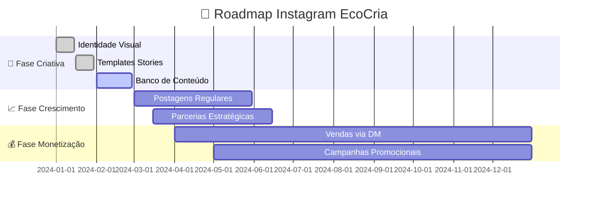

# 📸 EcoCria Instagram — Estratégia de Marca Visual

!!! tip "🎯 Objetivo Principal"
    **Transformar o Instagram da EcoCria na vitrine digital que reflete nossa identidade artesanal autoral, gera visibilidade estratégica e converte seguidores em clientes.**

---

## 🌟 Benefícios Esperados

=== "🔍 Visibilidade"

    | Benefício | Meta | Impacto |
    |-----------|------|---------|
    | **Alcance Orgânico** | 50k contas/mês | :material-trending-up: Exposição massiva da marca |
    | **Impressões Stories** | 100k/mês | :material-eye: Presença constante no feed |
    | **Hashtags Estratégicas** | Top 9 em #artesanato | :material-tag: Descoberta por público qualificado |
    | **Parcerias Criativas** | 4 colaborações/mês | :material-handshake: Expansão de rede |

=== "💪 Força da Marca"

    | Elemento | Objetivo | Resultado Esperado |
    |----------|----------|-------------------|
    | **Identidade Visual Única** | Reconhecimento imediato | :material-palette: Marca memorável |
    | **Storytelling Autoral** | Conexão emocional profunda | :material-heart: Fidelização do público |
    | **Autoridade Técnica** | Referência em artesanato sustentável | :material-school: Liderança de pensamento |
    | **Comunidade Ativa** | Engajamento consistente | :material-account-group: Base sólida de fãs |

=== "💰 Conversão em Vendas"

    | Métrica | Meta Mensal | Valor Estimado |
    |---------|-------------|----------------|
    | **Leads Qualificados** | 80 contatos | R$ 2.400 em oportunidades |
    | **Vendas Diretas (DM)** | 12 peças | R$ 3.600 faturamento |
    | **Direcionamento p/ Site** | 500 cliques | R$ 1.500 em conversões |
    | **Encomendas Personalizadas** | 6 projetos | R$ 4.500 receita premium |

---

## 🗺️ Jornada Estratégica - Fases de Implementação



---

## 📋 Atividades & Rotinas Semanais

### Segunda-feira — 🎨 **Criação Estratégica**

!!! note "Morning Creative Session"
    **09:00-11:00** — Sessão de fotos das peças da semana
    
    **Checklist:**  

    - [ ] 3 fotos de processo criativo  
    - [ ] 2 fotos de produto final  
    - [ ] 1 vídeo time-lapse (15-30s)  
    - [ ] Stories de bastidores (5-8 stories)  

### Terça-feira — 📝 **Conteúdo & Planejamento**

=== "Manhã (09:00-12:00)"
    
    **📱 Produção de Conteúdo**

    - Edição das fotos/vídeos
    - Criação de carrosséis educativos
    - Planejamento de legendas storytelling
    
=== "Tarde (14:00-16:00)"
    
    **🗓️ Agendamento Estratégico**

    - Posts programados para 7 dias
    - Stories planejados
    - Hashtags pesquisadas e organizadas

### Quarta-feira — 🤝 **Relacionamento & Engajamento**

!!! tip "Golden Hour de Engajamento"
    **Horários prioritários: 12:00-13:00 e 19:00-21:00**

| Atividade | Duração | Objetivo |
|-----------|---------|----------|
| **Responder DMs** | 30 min | :material-message-reply: Atendimento qualificado |
| **Comentar posts relevantes** | 45 min | :material-comment-multiple: Networking ativo |
| **Curtir e interagir** | 30 min | :material-thumb-up: Reciprocidade social |
| **Stories: Perguntas/Enquetes** | 15 min | :material-vote: Engajamento direto |

### Quinta-feira — 🎯 **Análise & Otimização**

??? abstract "Dashboard de Performance"
    
    **KPIs para Acompanhar:**
    
    | Métrica | Meta Semanal | Ferramenta | Status |
    |---------|--------------|------------|--------|
    | Novos seguidores | +150 | Instagram Insights | :material-chart-line: |
    | Alcance médio/post | 2.5k contas | Instagram Insights | :material-eye: |
    | Taxa de engajamento | >4.5% | Calculadora manual | :material-heart-pulse: |
    | Cliques no bio | +50/semana | Link tracking | :material-cursor-default-click: |
    | Saves por post | >25 | Instagram Insights | :material-content-save: |

### Sexta-feira — 🚀 **Inovação & Experimentação**

!!! experiment "Laboratório Criativo"
    
    **Testes da Semana:**
    
    - **Formato novo**: Reels, IGTV, carrossel?
    - **Horário diferente**: Testar performance em novo slot
    - **CTA inovadora**: Nova abordagem de call-to-action
    - **Hashtag strategy**: Combinação experimental

---

## ✅ Sistema de Checkpoints

### 🗓️ **Checkpoints Semanais** (Sextas, 17:00)

??? success "Semana Finalizada com Sucesso"
    
    **Critérios de Aprovação:**
    
    - [x] 7 posts publicados (1 por dia)
    - [x] 21+ stories publicados (3+ por dia)  
    - [x] 100% das DMs respondidas em até 2h
    - [x] 3 novas conexões relevantes feitas
    - [x] Métricas coletadas e organizadas

### 📊 **Checkpoints Mensais** (Última sexta do mês)

=== "📈 Performance"
    
    | Indicador | Meta | Real | Status |
    |-----------|------|------|--------|
    | Crescimento de seguidores | +600 | ___ | ⏳ |
    | Engajamento médio | 4.5% | ___ | ⏳ |
    | Leads gerados | 80 | ___ | ⏳ |
    | Vendas convertidas | R$ 12.000 | ___ | ⏳ |

=== "🎨 Qualidade"
    
    **Auditoria de Conteúdo:**
    - Consistência visual mantida?
    - Qualidade fotográfica profissional?
    - Storytelling autêntico e engajador?
    - Coerência com valores da EcoCria?

=== "🔄 Ajustes"
    
    **Pontos de Melhoria Identificados:**
    1. ________________
    2. ________________
    3. ________________
    
    **Ações para Próximo Mês:**
    1. ________________
    2. ________________
    3. ________________

---

## 🎯 Métricas & KPIs — Dashboard EcoCria

### 📱 **Métricas de Crescimento**

!!! info "Acompanhamento Semanal"

| KPI Principal | Meta Mensal | Semana 1 | Semana 2 | Semana 3 | Semana 4 | Status |
|---------------|-------------|----------|----------|----------|----------|--------|
| **Novos Seguidores** | +600 | | | | | :material-account-plus: |
| **Taxa de Crescimento** | 15% | | | | | :material-trending-up: |
| **Alcance Total** | 50k contas | | | | | :material-bullseye: |
| **Impressões Stories** | 100k | | | | | :material-eye-circle: |

### 💬 **Métricas de Engajamento**

=== "Interações Diretas"
    
    ```mermaid
    graph LR
        A[👥 Seguidores] --> B[❤️ Curtidas]
        A --> C[💬 Comentários] 
        A --> D[📤 Compartilhamentos]
        A --> E[💾 Saves]
        
        B --> F[📊 Taxa de Engajamento]
        C --> F
        D --> F
        E --> F
        
        F --> G[🎯 Conversão em Vendas]
    ```

=== "Qualidade das Interações"
    
    | Tipo | Meta Semanal | Pontuação | Impacto |
    |------|--------------|-----------|---------|
    | **Comentários com pergunta** | 15+ | 5 pts | :material-star: Alto valor |
    | **DMs sobre produtos** | 8+ | 10 pts | :material-diamond: Premium |
    | **Menções espontâneas** | 3+ | 8 pts | :material-trophy: Advocacy |
    | **Regrams de clientes** | 2+ | 12 pts | :material-heart: Fidelidade |

### 💰 **Métricas de Conversão**

!!! success "Funil de Vendas Instagram"

    **Topo do Funil** (Descoberta)  
        - Visualizações do perfil: 2.000/mês  
        - Alcance de hashtags: 15.000/mês  

    **Meio do Funil** (Consideração)   
        - Cliques no link da bio: 200/mês  
        - Saves de posts: 800/mês  
        - Stories assistidos completos: 60%  

    **Fundo do Funil** (Conversão)  
        - DMs comerciais: 80/mês    
        - Orçamentos solicitados: 25/mês  
        - **Vendas fechadas: R$ 12.000/mês** 🎉  

---

## 🔧 Ferramentas & Recursos

### 📊 **Stack de Analytics**

| Ferramenta | Função | Frequência de Uso |
|------------|--------|-------------------|
| **Instagram Insights** | Métricas nativas | :material-calendar-check: Diário |
| **Later/Hootsuite** | Agendamento de posts | :material-calendar-month: Semanal |
| **Canva Pro** | Design de templates | :material-palette: Conforme demanda |
| **Planilha Google** | Controle de KPIs | :material-table: Semanal |

### 🎨 **Banco de Assets**

??? tip "Biblioteca Visual Organizada"
    
    **📁 Estrutura de Pastas:**
    ```
    📂 EcoCria_Instagram/
    ├── 📂 01_Fotos_Produtos/
    │   ├── 📂 Madeira_Reciclada/
    │   ├── 📂 Pecas_Decorativas/  
    │   └── 📂 Móveis_Artesanais/
    ├── 📂 02_Process_Behind_Scenes/
    ├── 📂 03_Templates_Stories/
    ├── 📂 04_Videos_Timelapses/
    └── 📂 05_User_Generated_Content/
    ```

---

## 🎉 Campanhas Especiais

### 🌱 **"Artesão por um Dia"** — Campanha Trimestral

!!! example "Conceito da Campanha"
    Seguidores acompanham todo o processo de criação de uma peça, desde a escolha da madeira até o acabamento final.

=== "📅 Cronograma"
    
    **Semana 1:** Escolha da madeira + votação dos seguidores  
    **Semana 2:** Processo de design + sketches compartilhados  
    **Semana 3:** Execução com lives e time-lapses diários  
    **Semana 4:** Finalização + sorteio da peça para um seguidor

=== "🎯 Objetivos"
    
    - **+2.000 seguidores** durante a campanha
    - **500% aumento** no engajamento  
    - **50 leads qualificados** gerados
    - **R$ 15.000** em vendas indiretas

---


### 🌟 **Meta Anual Instagram EcoCria**

!!! quote "Visão 2024"
    **25.000 seguidores orgânicos | R$ 150.000 em vendas diretas | Referência nacional em artesanato autoral sustentável**

---

<div align="center">

<b>EcoCria</b> — Criando conexões autênticas através da arte 🌱✨

</div>
